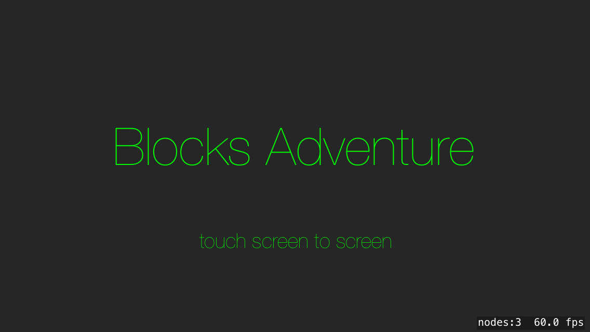
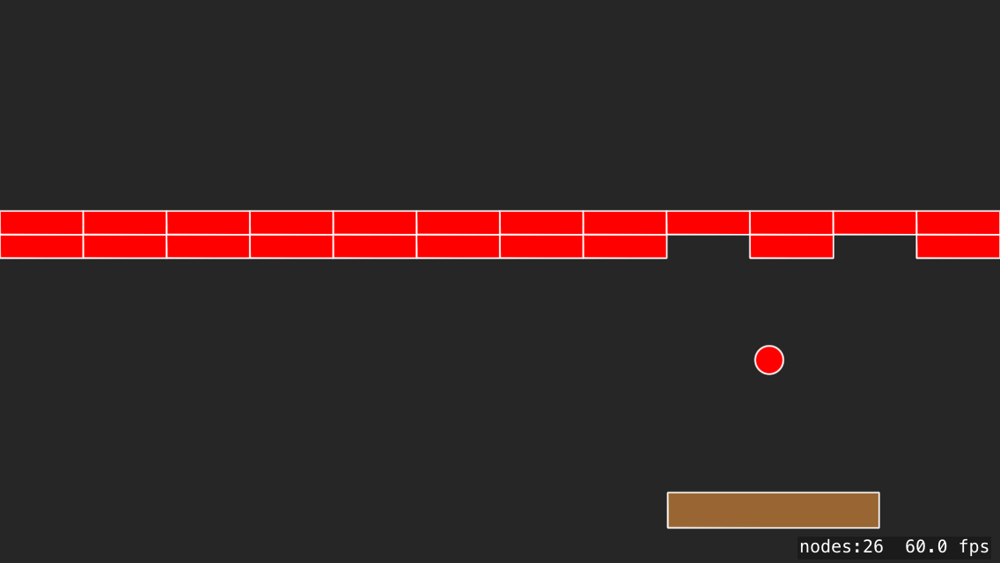
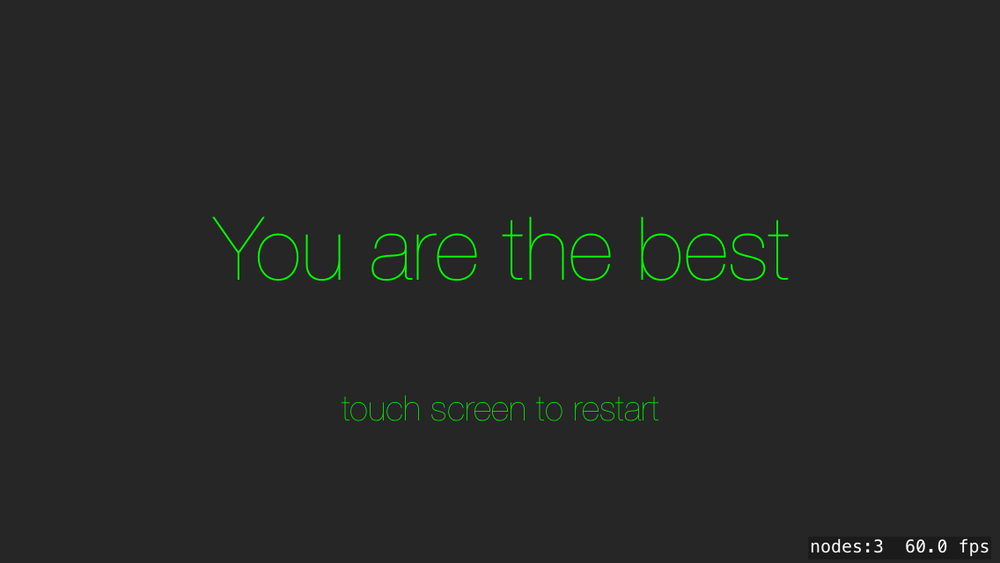

Blocos - SpriteKit Bircks Game
==============================

Summary
-------

This project is an example for iOS that implements a bricks game or arknoid like game with Apple SpriteKit. The exemploe is all writen in code without resource imafes files.
The game has 3 sceen: start sceen, game sceen and the victory sceen; 





#### Auto play

To make easier the navigation between sceen, the game has an autoplay code, that should be removed if you want to play the game.

auto play:
```swift
        //auto play
        if let paddle = childNode(withName: kPaddleName){
            if let ball = childNode(withName: kBallName){
                paddle.position.x = ball.position.x - paddle.frame.size.width/2.0
            }
        }
```

License & copyright
-------------------

Copyright 2021 Lourenço Gomes

Licensed under [MIT License](LICENSE)
